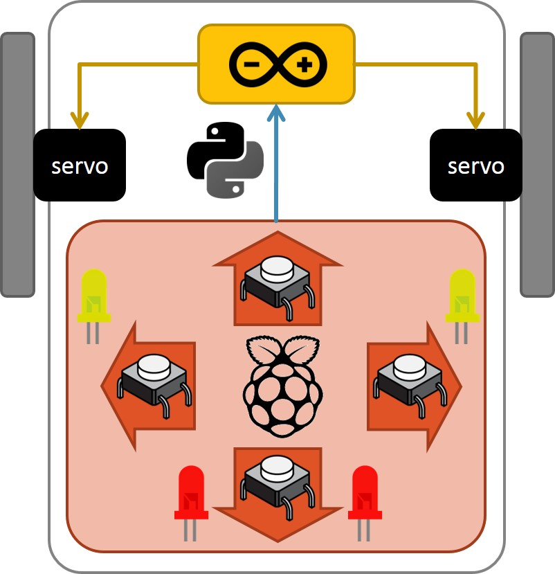
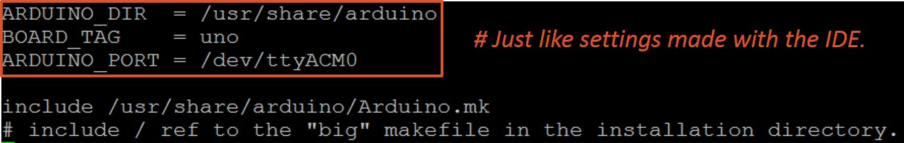
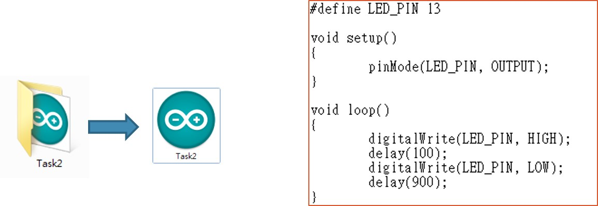
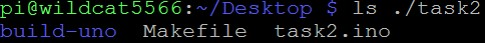

# Automation1062_Task2

## Task requests
### Vehicle motion control based on Raspberry pi and Arduino I/O interfaces.   
- Buttons: on Raspberry Pi.  
- Indicator lights: on Raspberry Pi.  
- Servo motors: on Arduino.  
  
 
  

### Communication
- Via serial port.  
  
 
### Raspberry Pi I/O Libraries
- Python + RPi.GPIO  
- C + BCM2835  
- C + WiringPi  
  
 
## Task setup
### Install Arduino
$ sudo apt-get -y install arduino  

### Install pip3
$ sudo apt-get update  
$ sudo apt-get -y install python3-pip  
$ pip3 install pyserial  
$ pip3 install python3-rpi.gpio  
  
 
## Additional: Arduino make tool
$ sudo apt-get -y install build-essential  
$ sudo apt-get -y install arduino-core arduino-mk  
  
 
### Take a look at the "big" makefile.
$ nano /usr/share/arduino/Arduino.mk
  

### Create project folder.
  
$ mkdir task2  
$ cd task2  
$ nano task2.ino  
  
 
### Create a "small" makefile in project folder.
$ nano Makefile  
When building, the make tool t akes the "makefile" as an input.  
The contents of Makefile is are just like the settings we make using the IDE.  
  
### Build project.
  
$ make  
Keep an eye on if any error messages are displayed.  
A "build-uno" folder will appear in the project folder.  
  
### Upload to board.
$ sudo make upload  
  
### Monitoring
$ stty -F /dev/ttyACM0 115200 raw -clocal –echo  
$ cat /dev/ttyACM0  
